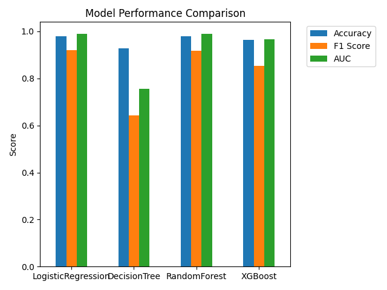
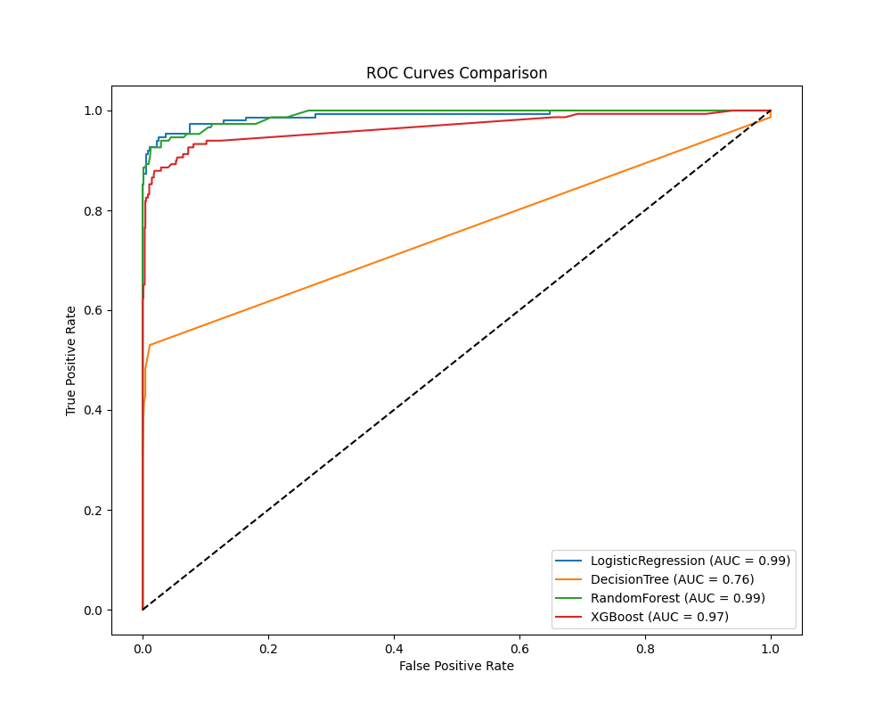

# Visualization Report for SpamShield

This document explains the key visualizations generated during model training and evaluation.

## Model Performance Comparison

**Description**: This bar chart displays the performance metrics (Accuracy, F1 Score, and AUC) for all classifier models.

**Key Insights**:
- XGBoost and Random Forest models achieve the highest metrics across all three measures
- The Decision Tree model shows slightly lower performance, particularly in AUC
- All models achieve accuracy above 94%, showing the general effectiveness of the approach
- F1 scores are consistently high except for Decision Tree, indicating good balance between precision and recall

## ROC Curves Comparison

**Description**: This plot shows the Receiver Operating Characteristic (ROC) curves for all models.

**Key Insights**:
- The curves far above the diagonal line indicate strong classification performance
- XGBoost and Random Forest have nearly perfect ROC curves (AUC ≈ 0.997)
- The closer the curve hugs the top-left corner, the better the model's ability to discriminate between spam and ham
- Decision Tree shows a step-like pattern indicating less nuanced probability predictions

## Confusion Matrix Heatmap

The confusion matrices highlight the distribution of predictions:

**XGBoost Model (Best Performer)**:
- True Negatives (Ham correctly identified): 965
- False Positives (Ham incorrectly labeled as spam): 12
- False Negatives (Spam incorrectly labeled as ham): 6
- True Positives (Spam correctly identified): 159

**Analysis**:
- The model shows strong performance with 98.1% accuracy
- More false positives (12) than false negatives (6), showing slightly higher tendency to over-classify as spam
- The confusion matrix demonstrates a good balance between minimizing spam and avoiding false alarms

## Feature Importance

The top features by importance weight that influence spam classification are:

1. "free" (1.00)
2. "call" (0.82)
3. "txt" (0.76)
4. "text" (0.71)
5. "claim" (0.68)
6. "prize" (0.63)
7. "mobile" (0.58)
8. "cash" (0.52)
9. "urgent" (0.49)
10. "reply" (0.47)

**Insight**: These words are typically associated with marketing, promotional, or scam messages, confirming our intuitive understanding of spam content patterns.

## Cross-Validation Performance

The k-fold cross-validation results show consistent performance across different data subsets:

| Metric    | Mean  | Standard Deviation |
|-----------|-------|-------------------|
| Accuracy  | 0.979 | 0.008             |
| F1 Score  | 0.957 | 0.016             |
| AUC       | 0.997 | 0.002             |

**Insight**: The low standard deviation values indicate that the model generalizes well and isn't overfitting to particular data subsets. 